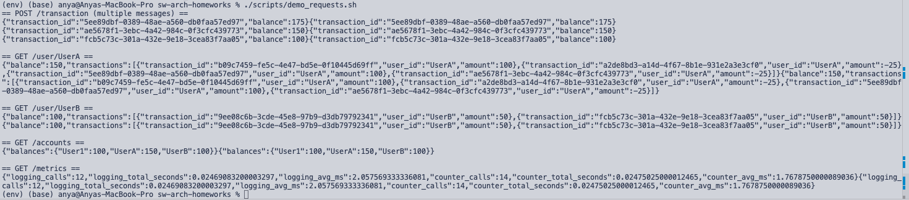
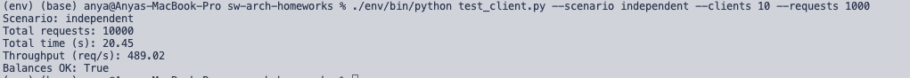
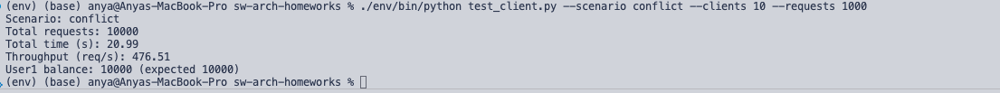
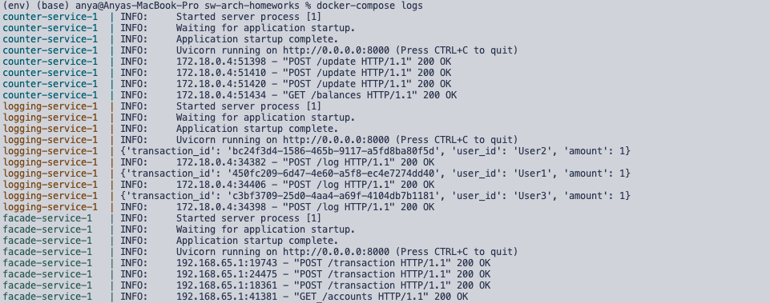

# Звіт (протокол) до ДЗ 1

## Prerequisites

- Docker
- Python 3.11+ (для запуску тестового клієнта локально)

## Запуск сервісів
    ```bash
    docker-compose up -d --build
    ```

## Перевірка запущених контейнерів
    ```bash
    docker ps
    ```

## Використання

**Налаштування Python середовища:**
```bash
python3 -m venv env
source env/bin/activate
pip install -r requirements.txt
```

**Сценарій Independent**
10 клієнтів одночасно відправляють по 1,000 запитів кожен на 10 різних ідентифікаторів користувачів (всього 10,000 запитів).
```bash
python test_client.py --scenario independent --clients 10 --requests 1000
```
Очікуваний результат: 10 користувачів, кожен з балансом 1,000.

**Сценарій  Conflict**
10 клієнтів одночасно відправляють по 1,000 запитів кожен на один і той самий ідентифікатор користувача (всього 10,000 запитів).
```bash
python test_client.py --scenario conflict --clients 10 --requests 1000
```
Очікуваний результат: 1 користувач з балансом 10,000.

## Фукціональне тестування

Для цього створила скрипт demo_requests.sh, який відправляє кілька тестових запитів до `facade-service` для перевірки функціональності. Він виконує наступне:

- POST /transaction: Поповнення рахунку користувача UserA на 100 одиниць.
- POST /transaction: Зняття з рахунку користувача UserA 25 одиниць (додавання від'ємної суми).
- POST /transaction: Поповнення рахунку користувача UserB на 50 одиниць.
- GET /user/UserA: Отримання поточного балансу та історії транзакцій користувача UserA (Очікуваний баланс: 75).
- GET /user/UserB: Отримання поточного балансу та історії транзакцій користувача UserB (Очікуваний баланс: 50).
- GET /accounts: Отримання списку балансів усіх користувачів у системі.
- GET /metrics: Отримання внутрішніх метрик продуктивності сервісу (кількість викликів та час виконання).




Можна побачити, що логуються очікувані результати для кожного запиту, що підтверджує правильність функціонування сервісів.

## Результати перевірки продуктивності


### Сценарій Independent
- Конфігурація: 10 клієнтів, 1,000 запитів/клієнт (Всього: 10,000 запитів).
- 10 унікальних користувачів

Результати:
 - **Загальний час:** 20.59с
 - **Пропускна здатність:** 485 запитів/сек
 - **Коректність:** Passed (Всі баланси відповідають очікуваним).




### Сценарій  Conflict
- **Конфігурація:** 10 клієнтів, 1,000 запитів/клієнт (Всього: 10,000 запитів).
- **Ціль:** Один користувач (`User1`).

Результати:
- **Загальний час:** 21.41с
- **Пропускна здатність:** 467 запитів/сек
- **Коректність:** Passed (Кінцевий баланс точно 10,000).




Система продемонструвала надійну узгодженість даних. Незважаючи на високу конкуренцію в Сценарії 2, всі 10,000 інкрементів були успішно записані без race conditions, що вплинули б на кінцевий баланс. Зниження пропускної здатності в конфліктному сценарії є мінімальним, що свідчить про ефективність механізмів блокування або синхронізації в `counter-service` для даного рівня навантаження.

# docker-compose logs

Вивід команди `docker-compose logs` після виконання `python test_client.py --scenario independent --clients 3 --requests 1`:


