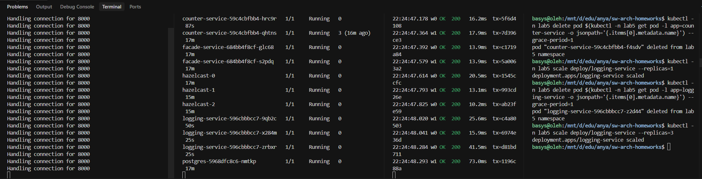
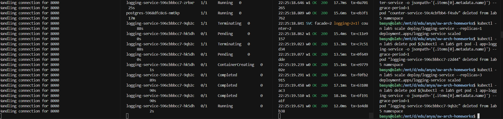
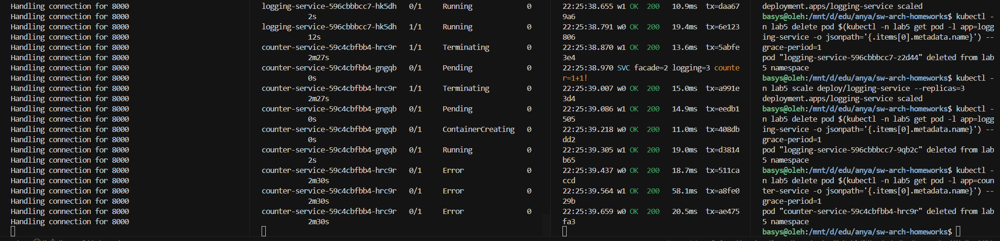
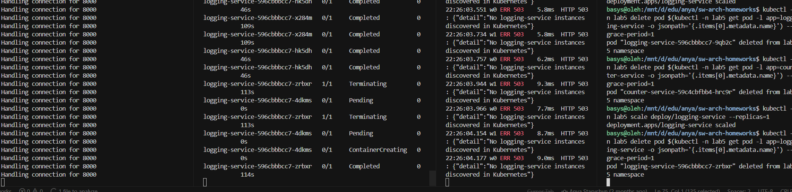
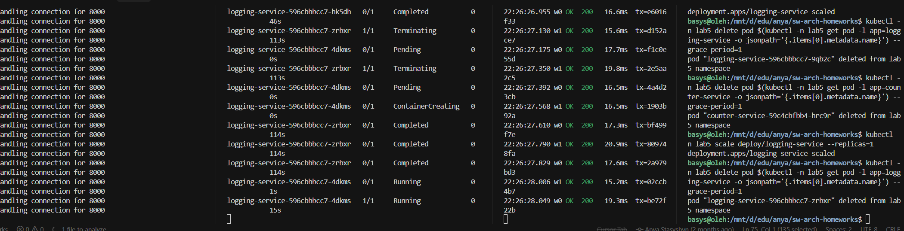

# Lab 5
## Setup

Зайти у minikube:

```bash
minikube start --cpus=4 --memory=7638 --driver=docker
minikube status
kubectl cluster-info
```  

Білд імеджів:  

```bash
docker build -t lab5/facade-service:latest  -f facade/Dockerfile  .
docker build -t lab5/counter-service:latest -f counter/Dockerfile .
docker build -t lab5/logging-service:latest -f logging/Dockerfile .

minikube image load lab5/facade-service:latest
minikube image load lab5/counter-service:latest
minikube image load lab5/logging-service:latest
```

Розгорнути все:

```bash
kubectl apply -k k8s
kubectl -n lab5 get all
```

Подивитися як піднімаються поди:

```bash
kubectl -n lab5 get pods -w
```

Коли усі поди `Running` і `Ready`, прокинути facade на localhost:

```bash
kubectl -n lab5 port-forward svc/facade-service 8000:8000
```

Швидка перевірка:

```bash
curl -sS http://localhost:8000/health
curl -sS http://localhost:8000/services 

curl -sS -X POST http://localhost:8000/transaction \
  -H "Content-Type: application/json" \
  -d '{"user_id":"u1","amount":5}'

curl -sS http://localhost:8000/user/u1
curl -sS http://localhost:8000/accounts
```

## Failover test

В одному терміналі тримаємо port-forward, у другому -- слідкуємо за подами, у третьому -- гонимо клієнта, у четвертому -- вбиваємо інстанси.

```bash
kubectl -n lab5 port-forward svc/facade-service 8000:8000

kubectl -n lab5 get pods -w

python failover_client.py --workers 2 --interval 0.2 --print-services-every 5
```

У T4 одним з варіантів видаляємо/перезапускаємо інстанс:

```bash
# logging kill one pod
kubectl -n lab5 delete pod $(kubectl -n lab5 get pod -l app=logging-service -o jsonpath='{.items[0].metadata.name}') --grace-period=1

# counter kill one pod
kubectl -n lab5 delete pod $(kubectl -n lab5 get pod -l app=counter-service -o jsonpath='{.items[0].metadata.name}') --grace-period=1

# scale до нуля і назад -- щоб побачити NotReady у /services
kubectl -n lab5 scale deploy/logging-service --replicas=1
kubectl -n lab5 scale deploy/logging-service --replicas=3
```

Результати failover тесту:

1) Початковий стан: сервіси відповідають, усі інстанси `Ready`.



2) Видалення одного pod `logging-service`: клієнт продовжує роботу, Kubernetes запускає новий pod.



3) Видалення одного pod `counter-service`: запити далі обробляються, сервіс відновлює репліку.



4) Масштабування і деградація: при зменшенні реплік видно зміни у статусах `/services` (NotReady/менше інстансів).



5) Відновлення після масштабування назад: повернення до стабільного стану з усіма репліками.




## Performance test

| Test scenarios | Task 1 (in-mem) | Task 3 (DB) | Task 5 (K8s) |
| :--- | :--- | :--- | :--- |
| **10 accounts (independent)** | Total time: `167.39s`<br><br>logging-service contribution: `50.43%`<br><br>counter-service contribution: `49.57%` | Total time: `258.11s`<br><br>logging-service contribution: `35.14%`<br><br>counter-service contribution: `64.86%` | Total time: `295.36s`<br><br>logging-service contribution: `43.24%`<br><br>counter-service contribution: `56.76%` |
| **1 account (conflict)** | Total time: `174.86s`<br><br>logging-service contribution: `49.91%`<br><br>counter-service contribution: `50.09%` | Total time: `271.26s`<br><br>logging-service contribution: `34.76%`<br><br>counter-service contribution: `65.24%` | Total time: `338.57s`<br><br>logging-service contribution: `45.62%`<br><br>counter-service contribution: `54.38%` |
